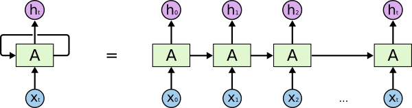

# Stock price prediction using Python

## What is stock price prediction?

It is the method of analyzing the past data of a specific stock in order to predict the future price for it.

In this repo, I used Python with RNN(LSTM) model to predict Tesla stock price, hoping that I can make Elon Musk happy along the way.
